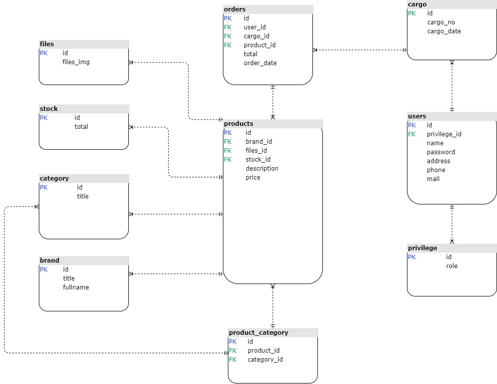

# Elektronik Ürün Satış Sitesi

   
 Elektronik ürün satış sitesine başvuran kişilerin giriş ve kayıt işlemlerinin hızlı ve kolay bir şekilde gerçekleştirilebilmesi, elektronik ürün bilgilerinin bir veri tabanında kayıt altında tutulması gerektiğinde ürün bilgilerine admin tarafından erişilebilmesi,(geçmişten bugüne kadar yapılan alınan ürünlerin ne zaman hangi gün alındığını) müşteriye ürünlerin kategorize halinde sunulacağı ve satış işlemlerinin rahatça yapılacağı bir e-ticaret sitesidir. 

   
   
 ***Yalnızca OrderPage kısmındaki CRUD operations çalışmıyor ve en son güncellenmediğinden UML diagramda hata olabilir. 

   
 # Kullanılan Teknolojiler
   Java, 
   JSF,
   PostgreSQL,
   GlassFish,
   XHTML,
   CSS,
   MVC,
   OOP
   ve 
   Bootstrap

# İlişkisel Veritabanı Tasarımı

